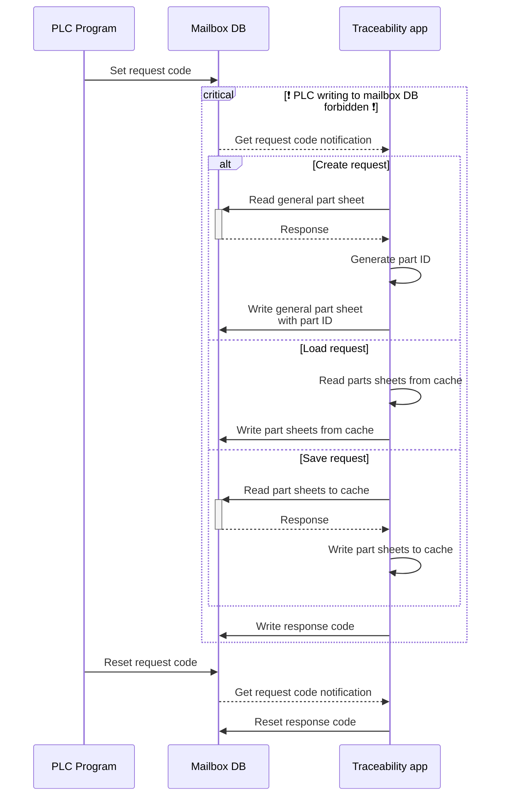

# OPC-UA Line Gateway

Gateway for machines of an industrial production line, using OPC-UA to connect to
PLCs, with data caching and archiving.

## How it works

This project provides executable services, intended to run forever. The service
connects to the PLCs of the machines to allow them to request data save or retrieval.
The data is kept in a disk-backed memory cache to allow efficient storage and fetching.

### OPC-UA

The service acts as multiple OPC-UA clients, each one connected to an OPC-UA server
on a machine (PLC). Upon disconnection from the machine, the client tries to reconnect
forever.

### Configuration

This section summarizes the configuration contents.

#### Common

* Application URI
* OPC-UA PKI directory

#### For each OPC-UA server

* Target URL (e.g. `opc.tcp://ip-or-hostname:port`)
* Security Policy (e.g. `Basic256Sha256 - Sign & Encrypt`)
* Authentication mode (anonymous, user/pass, …)

#### For each traceability-enabled machine

* Namespace URL for Traceability NodeSet
* Request byte NodeId
* Response byte NodeId
* Part data sheet Objects NodeIds

## Traceability Protocol

