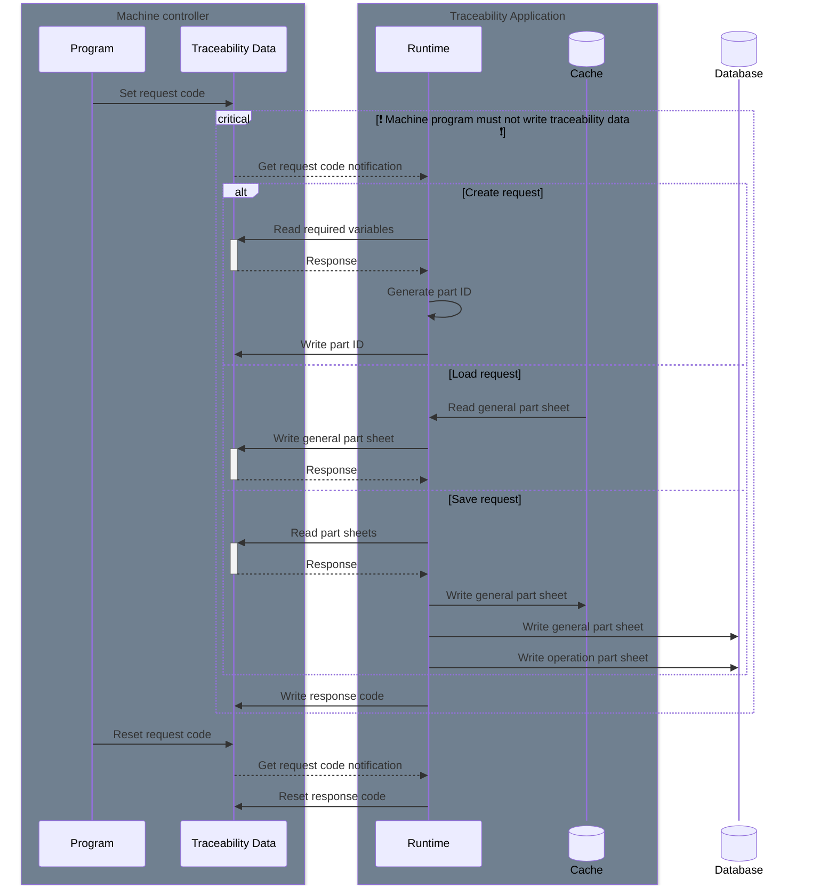

# OPC-UA Line Gateway

Gateway for machines of an industrial production line, using OPC-UA to connect to
PLCs, with data caching and archiving.

## How it works

This project provides executable services, intended to run forever. The service
connects to the PLCs of the machines to allow them to request data save or retrieval.
The data is kept in a disk-backed memory cache to allow efficient storage and fetching.

### OPC-UA

The service acts as multiple OPC-UA clients, each one connected to an OPC-UA server
on a machine (PLC). Upon disconnection from the machine, the client tries to reconnect
forever.

### Configuration

The application binary expects the path to a TOML configuration file as its first
command line argument.

The configuration structure is described in this [documentation](docs/configuration.md).

## Systemd service

The service and user setup is handled by the Debian package, for a single gateway
instance per host.

### Configuration

Systemd creates `/etc/opcua-line-gateway` and `/var/lib/opcua-line-gateway`,
owned by the service user, on the first start. Create the configuration
directory beforehand to be able to install the configuration:

The unit passes `/etc/opcua-line-gateway/config.toml` as the first positional
argument. Paths inside it may be relative, in which case they resolve against
`/var/lib/opcua-line-gateway` (the unit's working directory):

```toml
#:schema https://github.com/cailloumajor/opcua-line-gateway/releases/latest/download/config.schema.json

application_uri = "urn:example:line-gateway:line1"

pki_dir = "pki"

[traceability]
redb_file = "cache.redb"
# …

[traceability.database]
password_file = "/etc/opcua-line-gateway/db_password"
# …
```

The application refuses to start unless the database password file mode is
exactly `0600`, so it must belong to the service user:

```sh
sudo install -m 0600 -o opcua-line-gateway -g opcua-line-gateway \
    /dev/null /etc/opcua-line-gateway/db_password
sudo -u opcua-line-gateway tee /etc/opcua-line-gateway/db_password <<<"…"
```

The OPC-UA certificate and private key are expected at
`pki_dir/own/opcua-line-gateway-cert.der` and
`pki_dir/private/opcua-line-gateway-key.pem`. Servers' certificates to trust go
into `pki_dir/trusted`.

### Operation

```sh
journalctl -u opcua-line-gateway -f
```

Log verbosity is set by `RUST_LOG` in the unit (`info` by default); override it
with `sudo systemctl edit opcua-line-gateway` rather than by editing the
installed unit.

## Traceability

This service handles traceability management, which involves moving data between,
on one side, OPC-UA servers it connects to, and on the other side, an in-memory
disk-persisted cache and a ClickHouse database.

The data consists of groups of OPC-UA variables, which can be scalars or arrays
of scalars. Grouping is achieved by organizing variables in a group as properties
of an OPC-UA object. In this project's terminology, some groups are called
"part sheets".

OPC-UA server data is organised in three groups:

* The "traceability protocol" group, which includes the request code, the response
code, and the OPC-UA client heartbeat;
* The "general part sheet" group, which includes data that is common to all OPC-UA
servers;
* The "operation part sheet" group, which includes data that is specific for each
operation on the production line.

### Protocol


```mermaid
sequenceDiagram
    box slategrey Machine controller
        participant Program
        participant Data as Traceability Data
    end
    box slategrey Traceability Application
        participant us as Runtime
        participant Cache@{ "type": "database" }
    end
    participant Database@{ "type": "database" }

    Program->>Data:Set request code
    critical❗ Machine program must not write traceability data ❗
        Data-->>us: Get request code notification
        alt Create request
            us->>+Data: Read required variables
            Data-->>-us: Response
            us->>us: Generate part ID
            us->>Data: Write part ID
        else Load request
            Cache->>us: Read general part sheet
            us->>+Data: Write general part sheet
            Data-->>-us: Response
        else Save request
            us->>+Data: Read part sheets
            Data-->>-us: Response
            us->>Cache: Write general part sheet
            us->>Database: Write general part sheet
            us->>Database: Write operation part sheet
        end
        us->>Data:Write response code
    end
    Program->>Data:Reset request code
    Data-->>us:Get request code notification
    us->>Data:Reset response code
```
