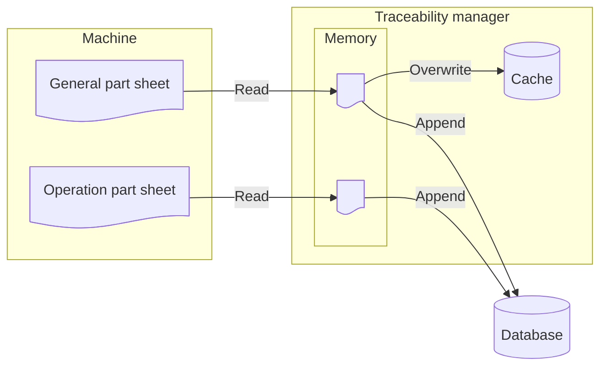
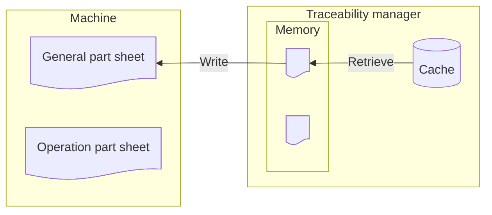

# Traceability data flow

## Involved components

### Machine

An industrial machine which populates data for each produced part (part sheets).
There are two kinds of part sheets:

* General part sheet, holding the data that is common to all operations (i.e. this
part sheet structure is identical on all machines).
* Operation part sheet, containing the data that is specific for each operation.

### Traceability manager

The service handling the management of traceability data, connected to all the machines
of the production line. The scope of this project includes this component.

### General part sheet cache

A key-value store embedded in the binary holding the traceability manager. For one
part identifier (unique ID), the cache stores the last saved version of the general
part sheet (i.e. a save operation on an existing part identifier overwrites the
part sheet).

### Database

A column-oriented (data is stored by column) database, for storing part sheets (general
and operation). Saving part sheets in the database never overwrites data, but adds
a new row, which means that saved part sheet values will be available even after
new saves with the same part identifier.

## Flow diagrams

### Saving operation

### Reading operation

